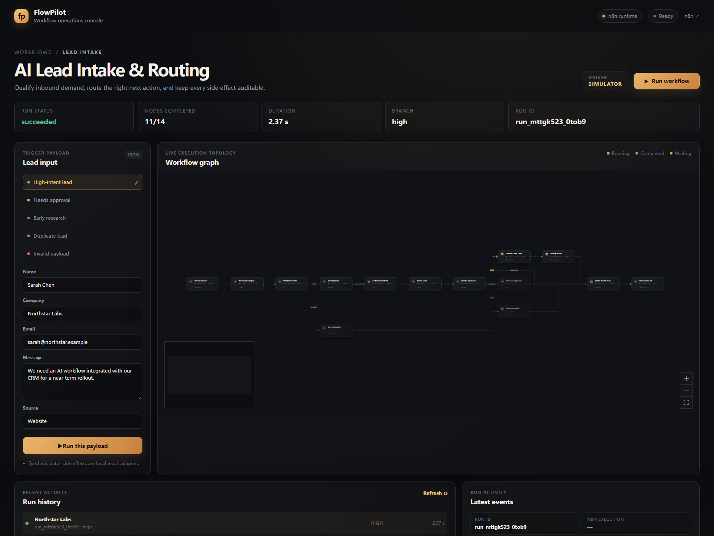
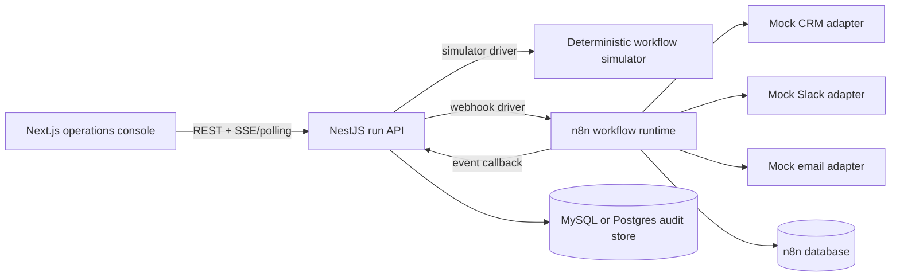

# FlowPilot

> A standalone, observable n8n workflow console for AI lead intake, routing, approvals, and auditability.

FlowPilot is deliberately separate from Agent Studio. It demonstrates a different engineering surface: **n8n executes the workflow, NestJS owns the run contract and event protocol, and Next.js renders the live operations console**.

[**Vercel deployment guide**](DEPLOY.md) · [**Architecture**](docs/architecture.md) · [**Event protocol**](docs/event-protocol.md)



## What this demo proves

- A real workflow topology with validation, deduplication, deterministic AI qualification, score-based routing, CRM/Slack/email adapters, human approval, and a structured response.
- A run-oriented backend contract rather than a black-box “call an agent” endpoint.
- Live node state, branch selection, approval state, event history, and audit metadata over SSE locally or durable polling on Vercel.
- The same UI can run against a fast local simulator or the bundled n8n runtime.
- A reproducible Docker Compose path with Postgres persistence and imported n8n workflow JSON.

The demo uses synthetic leads and local mock integration adapters. No external CRM, Slack workspace, email provider, or LLM key is required.

## Architecture



### Responsibility boundaries

| Layer | Owns |
| --- | --- |
| `packages/contracts` | Workflow definition, run state, event types, lead payloads, approval contract |
| `apps/api` | REST API, SSE stream, simulator, n8n webhook driver, approval resume, persistence |
| `apps/web` | Payload editor, scenario presets, graph state, run history, inspector, approval actions |
| `n8n/workflows` | Executable n8n topology and event-emission subworkflow |
| `infra/mysql` / `infra/postgres` | FlowPilot-prefixed audit tables and local n8n database bootstrap |

See [the architecture notes](docs/architecture.md) for the event lifecycle and extension points.

## Quick start — zero infrastructure

The simulator is the fastest way to inspect the product locally. It keeps all state in memory and does not touch any database.

```powershell
cd flowpilot
pnpm install
Copy-Item .env.example .env
pnpm dev
```

Open [http://localhost:3000](http://localhost:3000). Choose a scenario and run it. The API is available at [http://localhost:3001/api/health](http://localhost:3001/api/health).

### Scenario matrix

| Preset | Expected route | What to demonstrate |
| --- | --- | --- |
| High-intent lead | Sales / CRM + Slack | Straight-through side effects |
| Needs approval | Human approval → CRM + Slack | Pause/resume over the approval contract |
| Early research | Nurture email | Low-intent branch |
| Duplicate lead | Skip side effects | Idempotency/deduplication branch |
| Invalid payload | Error handler | Validation failure and structured rejection |

## Full n8n stack

Docker Compose starts Postgres, the NestJS API, n8n, and the Next.js console. The n8n image imports the three checked-in workflow files on its first start.

```powershell
cd flowpilot
pnpm workflows:generate
pnpm workflows:validate
docker compose up --build
```

Then open:

- Console: [http://localhost:3000](http://localhost:3000)
- API health: [http://localhost:3001/api/health](http://localhost:3001/api/health)
- n8n editor: [http://localhost:5678](http://localhost:5678)

The Compose profile uses `WORKFLOW_DRIVER=n8n`, so a run created by the console is sent to `POST /webhook/flowpilot-lead-intake`. n8n sends event batches back to `POST /api/internal/n8n/events`; the API then fans them out to the browser over SSE.

After all four containers are healthy, run `pnpm smoke` to exercise high, low, duplicate, invalid, approved, and rejected paths against the live n8n/Postgres stack. The smoke test also verifies that every graph node reaches either `success` or `skipped` and that each run emits exactly one `run.started` event.

To reset the local databases and repeat the first-start import:

```powershell
docker compose down -v
docker compose up --build
```

If the n8n image is used without Compose, import the files from `n8n/workflows/` with the n8n CLI or the editor. Keep the `flowpilot-emit-event` workflow available because the main workflow calls it as a sub-workflow.

## Deploy like Agent Studio

The repository is ready to be imported into Vercel twice, just like the current Agent Studio deployment:

| Vercel project | Root Directory | Runtime |
| --- | --- | --- |
| FlowPilot Web | `apps/web` | Next.js |
| FlowPilot API | `apps/api` | NestJS as one Vercel Function |

The API accepts the same `MYSQL_HOST`, `MYSQL_PORT`, `MYSQL_USER`, `MYSQL_PASSWORD`, `MYSQL_DB`, and `MYSQL_SSL` variables used by Agent Studio. FlowPilot does not reuse Agent Studio tables: it creates only `flowpilot_workflow_runs` and `flowpilot_workflow_events` in the shared database.

n8n itself remains a separate long-running service (n8n Cloud, Railway, Render, or another container host). Set `FLOWPILOT_API_URL` in n8n to the public FlowPilot API project URL and set the same `N8N_EVENT_SECRET` on both sides. Follow [DEPLOY.md](DEPLOY.md) for the exact project roots, variables, deployment order, and verification URLs.

## API surface

| Method | Endpoint | Purpose |
| --- | --- | --- |
| `GET` | `/api/health` | Driver and persistence health |
| `GET` | `/api/workflows/lead-intake` | UI topology definition |
| `GET` | `/api/runs` | Recent run list |
| `POST` | `/api/workflows/lead-intake/runs` | Start a run |
| `GET` | `/api/runs/:runId` | Current run state |
| `GET` | `/api/runs/:runId/events` | Immutable event history |
| `GET` | `/api/runs/:runId/events/stream` | SSE stream (`run-event`) |
| `POST` | `/api/runs/:runId/approve` | Resolve a waiting approval |
| `POST` | `/api/internal/n8n/events` | Authenticated n8n event callback |
| `POST` | `/api/integrations/ai/qualify` | Deterministic or OpenAI-compatible qualification adapter |

Example start request:

```json
{
  "input": {
    "name": "Sarah Chen",
    "company": "Northstar Labs",
    "email": "sarah@northstar.example",
    "message": "We need an AI workflow integrated with our CRM for a near-term rollout.",
    "source": "website",
    "scenario": "high"
  }
}
```

## Development commands

```powershell
pnpm typecheck
pnpm test
pnpm build
pnpm workflows:generate
pnpm workflows:validate
pnpm smoke
```

Useful package-local commands:

```powershell
pnpm --filter @flowpilot/api test
pnpm --filter @flowpilot/web test
pnpm --filter @flowpilot/api start
pnpm --filter @flowpilot/web dev
```

## Persistence and adapters

- `PERSISTENCE_DRIVER=memory` is the default and is ideal for a portfolio demo or a quick local run.
- `PERSISTENCE_DRIVER=mysql` reuses Agent Studio-compatible `MYSQL_*` connection variables while keeping FlowPilot data isolated in `flowpilot_*` tables. This is the recommended Vercel configuration.
- `PERSISTENCE_DRIVER=postgres` keeps the local Docker path available through `DATABASE_URL`, also using `flowpilot_*` tables.
- `WORKFLOW_DRIVER=simulator` keeps execution deterministic and requires no n8n process.
- `WORKFLOW_DRIVER=n8n` uses `N8N_WEBHOOK_URL` and the event callback secret.
- CRM, Slack, and email endpoints are intentionally local mock adapters. They return provider-shaped records so the integration boundary is visible without causing external side effects.
- The “AI” qualifier is deterministic by default. If `OPENAI_API_KEY` is present, the API uses the configured OpenAI-compatible `/chat/completions` endpoint and falls back to the deterministic adapter on errors.

## Repository layout

```text
apps/api/                 NestJS API, simulator, SSE, persistence
apps/web/                 Next.js operations console
packages/contracts/       Shared TypeScript contracts and graph definition
n8n/workflows/             Importable n8n workflow JSON
infra/mysql/               Shared-MySQL-safe FlowPilot schema
infra/postgres/            Postgres bootstrap SQL
scripts/                   Deterministic workflow generator + validator
docs/                      Architecture and protocol notes
```

## Design notes

- The workflow graph is a **read model** for the console; n8n remains the execution authority when the n8n driver is selected.
- Every event has a run ID, workflow ID, sequence number, timestamp, and optional node/branch/output metadata.
- Local SSE uses a replay buffer. Vercel uses `NEXT_PUBLIC_EVENT_TRANSPORT=polling`, making MySQL the cross-instance source of truth instead of relying on one warm function instance.
- Approval is event-driven in both modes: the simulator records the decision before releasing its waiter, while n8n resumes the signed Wait webhook and emits `approval.resolved` from the workflow itself.
- All demo data is synthetic. Replace the adapter modules and environment values before using this as a production integration.

## License

MIT. See [LICENSE](LICENSE).
